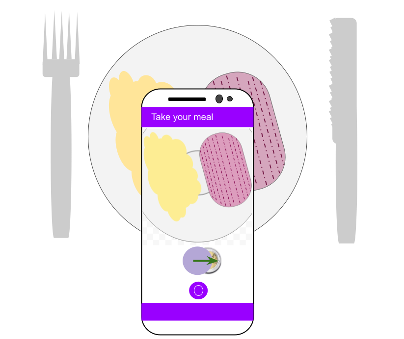
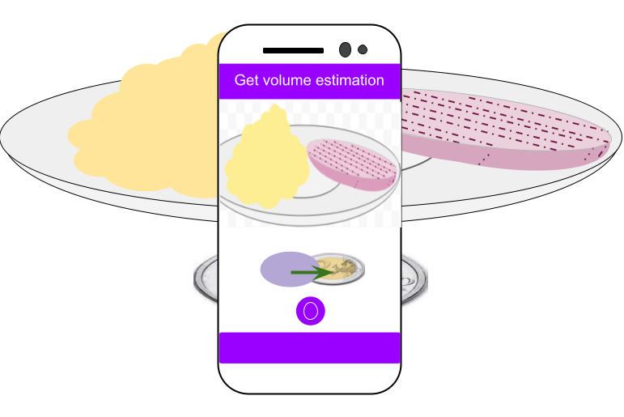

# DietVision - An App for Image-based Food Identification and Volume Estimation


By [Michael Hofmann](https://github.com/michaelof66), [Jessica Ramaux](https://github.com/JessieRamaux) & [Léopold Maillard](https://github.com/leopoldmaillard), under the supervision of [Prof. Dennis Shasha](https://cs.nyu.edu/~shasha/) (Courant Institute of Mathematical Sciences, New York University).

A detailed technical report of this project can be found [here]().

## Overview

DietVision is a mobile app that conveniently estimates nutritional values of a meal from images. It is cross-platform and was built using the [Flutter Framework](https://flutter.dev). Our method is oriented towards robustness and user accessibility, so that it is not limited to laboratory settings and can be used by everyone and on a large variety of meals.

Our dietary assessment pipeline relies on a combination of a deep learning model, traditional computer vision algorithms and user feedback. Food detection and classification is performed by a semantic segmentation deep neural network that classify each pixel of an input image in its associated major food group. The challenging stage of volume estimation is achieved by taking two pictures with different camera angles and requires the user to place an everyday life fiducial marker such as a coin along the meal. Finally, the user will be able to visually adjust the result so as not to be restricted by a possible inaccurate prediction. The app also implements extra features such as a detailed meal history, dietary habits statistics and personalized user preferences.

## Installation

We are targeting a release on the Apple App Store and the Google Play Store in order to ease the installation process and reach a larger audience. However, for now the app can be compiled and installed from the source code by following these few steps : 

- Follow the official [Flutter documentation](https://flutter.dev/docs/get-started/install) to properly set up the Flutter SDK on your system.
- Clone the project's repository :

```
$ git clone https://github.com/leopoldmaillard/diet-vision-flutter.git
```
- Navigate to the project's root directory and run :
```
$ flutter run --no-sound-null-safety --release
```
Note that Apple's Xcode is required to run the app on an iOS device as well as trusting the app in the device's settings.

## Example of use

After launching the app, the user traverses menu pages until he/she is asked to take two pictures of the presented food along with a fiducial marker such as a two Euro coin. (The marker can be changed in the preferences tab.)

### Taking a first picture

The first picture is a top-view one and is used to detect food as well as to compute the surface it occupies. The fiducial coin is used as a reference object to get the right scale. It is placed between the user and the dish and the smartphone must be directly above it, in order to get the most correct top-view. The user has to make the coin match as closely as possible with the purple circle displayed at the bottom of the camera preview screen.


 
 After a few seconds, a list of detected food items is displayed along with their associated surface in square centimeters.
 
 ### Taking a second picture
 
The purpose of the second picture is to estimate the volume of each food class detected in the first picture. The thickness of each food item must be obtained and to do so, the picture must be taken at a 45° angle. The coin should not be moved. Again, the user will match the coin with a purple ellipse (that corresponds to a circle viewed at an angle of 45°).



After this second picture has been taken, the food items list will be displayed again, with this time their volume estimation in cubic centimeters.

### Using Feedback to improve accuracy

When the volume estimation results are displayed, the user is given the possibility to adjust them. Two categories of feedback can thus be performed to manually improve the final results :

- Food item classification : in the event that the machine learning model misclassifies a food item, the user is able to adjust the selection by tapping on it and selecting the appropriate class. A food class can also be deleted from the selection.

- Food item thickness : the estimated thickness of each food item can be visually adjusted thanks to a slider which moves on the picture the points that correspond to the ’minimum’ and the ’maximum’ position of the thickness. Note that we aim here at estimating the mean thickness of a food. If an item does not have a consistent thickness (e.g. a mashed potatoes portion), the system will ask the user to determine a mean value that will lead to an accurate volume estimation.

## Known issues and potential improvements

## References

Frank Po Wen Lo, Yingnan Sun, Jianing Qiu, and Benny Lo. Image-Based Food Classification and Volume Estimation for Dietary Assessment: A Review. *IEEE Journal of Biomedical and Health Informatics*, 24(7):1926–1939, 2020.

Google. [Seefood Mobile Segmenter v1](https://tfhub.dev/google/seefood/segmenter/mobile_food_segmenter_V1/1). *Tensorflow Hub Repository*, 2021.

David Haytowitz U. Ruth Charrondiere and Barbara Stadlmayr. FAO/INFOODS DensityDatabase Version 2.0, 2012.
